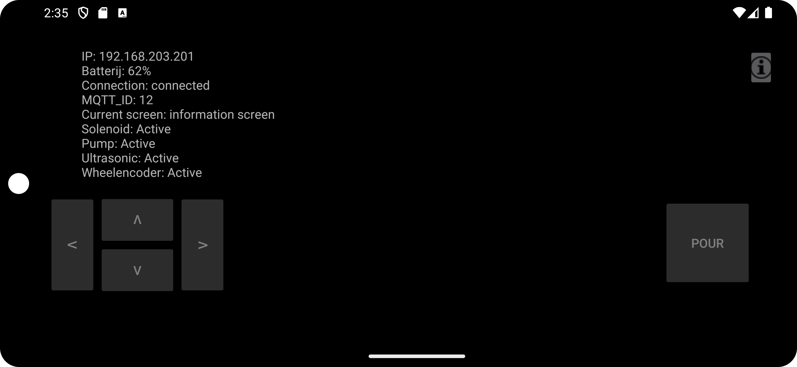

# Info Screen



When you press the info icon in the top right corner, as talked about in the [mainScreen](mainScreen.md). This transparent layout covers the screen. The robot stops moving and you won't be able to press any other button exept for the info icon

```
// button to change visability of info screen on button press
info.setOnTouchListener(new View.OnTouchListener() {
            @Override
            public boolean onTouch(View v, MotionEvent event) {
                if(event.getAction() == MotionEvent.ACTION_DOWN) {
                    transparentOverlay.setVisibility(
                            transparentOverlay.getVisibility() == View.VISIBLE ? View.GONE : View.VISIBLE
                    );
                }
                else if (event.getAction() == MotionEvent.ACTION_UP) {}
                return false;
            }
        });
```

Here we want to show relevant sensor data the user might want to see. 

if you press the info icon again the overlay dissapears and you can continue to control the robot.