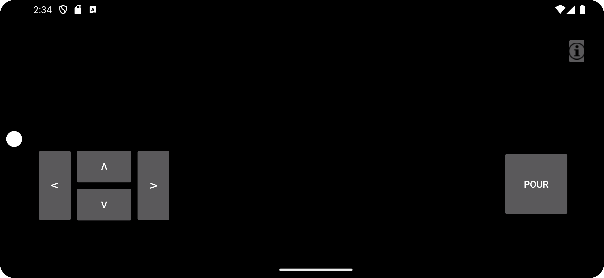

# Main Screen


The screen where you can control the robot  
---

### The buttons
Here you have four buttons which can control the robot. When pressed we have an onTouchListener, so we can see when the butten is being pressed down. If it is pressed down We will send an [MQTT](mqtt.md) message to the broker where the Raspberry pi can see the message and act acordingly. 

When the button is released the app sends another message to stop the robot. 

example code:
``` java
// code for button forward, that sends and mqtt message
forward.setOnTouchListener(new View.OnTouchListener() {
            @Override
            public boolean onTouch(View v, MotionEvent event) {
                if(event.getAction() == MotionEvent.ACTION_DOWN) {
                    publishMessage("direction","f" );
                }
                else if (event.getAction() == MotionEvent.ACTION_UP) {
                    publishMessage("direction","s" );
                    SystemClock.sleep(500);
                }
                return false;
            }
        });
```  

for the pour button we have similar code. The diffrence is that we only have a listener for when the button is pressed.


### The webview

The black background of our app represents the view of the camera. More about it in [Video streaming](video_feed.md)

### The info screen

When pressing the info button in the top right corner, an transparent overlay with sensor data covers the screen. More about it in [infoScreen](infoScreen.md).