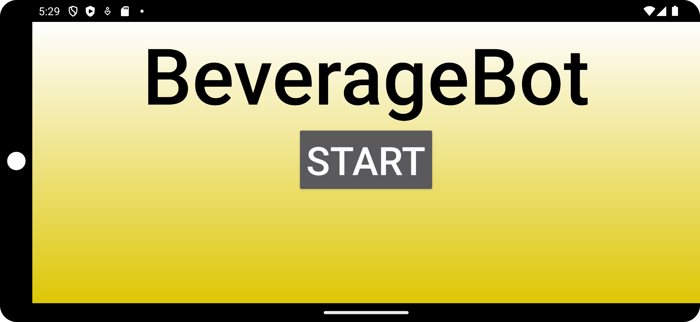

# Splash screen  

  

this is the first screen you can see when you start up the app.

when you press the start button, the app tries to connect to the pi via [MQTT](mqtt.md) <!-- change when you know the title of mqtt md file --> and you get redirected to the [mainScreen](mainScreen.md) where you can control the robot.  
